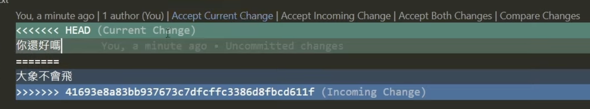

# Git Practice note!

```c
$ git status
// 觀看目前資料夾狀態

$ git add .
// 將所有檔案加入暫存區

$ git commit -m "git init"
// 將暫存區的檔案進行 commit，-m 後面為 commit 的訊息

$ git commit --amend -m "git init again"
// 修改最後一次 commit 的訊息

$ git commit --amend --no-edit
// 將暫存區的檔案併入最後一次 commit

$ git log
// 查詢所有 commit 紀錄

$ git log -p
// 參數 -p 顯示 commit 詳細資訊

$ git log --oneline --graph
// 參數 --oneline 顯示更精簡的 commit 紀錄
// 參數 --graph 顯示 commit 線圖

$ git log --all
// 參數 --all 顯示包含 branch 的紀錄
```
```c
$git remote add origin https://github.com/jeremy900425/Git-Practice-note.git
//把本地端的資料夾連線到github的repo。不一定要叫origin

$git push origin master
//就是把你的master branch推上origin <origin就是你的github repo>
$git push -u origin master
//-u：代表把預設的remote設定成origin 未來push如果不指定remote都會推到origin

//所以說只要用過$git push -u origin master之後都只要打git push就好
```

```c
$git reset -- <檔案名稱>
//把add的檔案移除，因為commit只會推上有add過後的檔案

$git checkout -- <檔案名稱>
//pull後 對A檔案做了修改，想要恢復成原本pull下來的狀態就使用這個指令 #要先unstage

$git reset --soft HEAD~1
//如果commit訊息打錯了，可以回覆一次（~恢復幾次）
```

## conflicts概念
A修改一段訊息“大象會飛”並且已經commit並推上github了
此時，B還沒有git pull，把“大象會飛”改成“你還好嗎”，此時直接push就會出錯，因為B並沒有把最新的檔案pull下來
但是當B執行pull的時候，git會自動偵測到衝突的地方，如下圖所示

如果用vscode就可以直接按Accept Current Change選擇自己的內容，如果兩個都是你要的可以先按both那個再自己手動修改

## Git branch是解決怎樣的事情
1. push上的都要是已經完成的功能
2. 解決彼此的conflicts
##### 所以說只要開了一個自己的分支就不用怕一直被conflicts了，只是最後要整併進main branch的時候還是要除錯

```c
$git checkout -b <branch名稱>
//建立新branch並切換過去

$git branch
//查看電腦上的branch(按q可以離開)
$git branch -a
//查看所有的branch(包含remote)
//然後假設B那這個new_branch上面做了幾次開發也commit了數次
//A在main上面做了修改也commit並push上去

$git push -u origin new_branch
//把新增的branch推上github

$git switch <branch名稱> or main
//切換分支 #要切換分支必須先做commit，技巧是可以先亂commit等到切回來的時候使用undo last commit來取消上次亂commit的動作

```
把branch推上去後就可以在github上面看到這個branch


以下是main的md檔案內容，未有branch中的更新


以下是我在branch中有commit並且推上去的更新，接下來就是如何把 branch 整併到 main 中


### 整併branch到main中有兩種方法
1. 在github上面直接使用pull request功能(推薦)
    
    下圖：點選 Compare&pull request 或是 Open pull request都可以
    

    下圖：點進去後顯示的是現在準備把test_branch整併進入main裡面，此時系統會檢查是否有衝突（Able to merge表示無衝突），這時候點一點就會發現成功發PR了，接下來就等專案管理者同意merge到main branch裡面
    
    下圖：專案管理者同意後，查看commit紀錄就會發現有pull request的紀錄了
    

    下圖：有衝突如圖所示，解法是「rebase」，意思就是現在main可能有繼續更新，那現在只要把我目前做的東西接在main的最後面就解決了
    
    
    先使用 git switch main 切換到 main分支，然後使用git pull把最新的進度抓下來，接著git switch new_branch，輸入
    ```c
    $git rebase <rebase到哪個分支>
    ```
    然後就會出現衝突需要解決，解決完之後輸入
    ```c
    $git rebase --continue
    //解完後繼續剛剛的rebase操作（有可能衝突要解複數次）
    ```
    成功rebase後，此時輸入 git log 就會看到main最新的commit以及branch上面的commit(我的commit會是最新的，因為在做rebase)
    此時就可以執行git push，但是也有可能會出錯，因為剛剛做了rebase，此時本地的log和remote的log不相容，以下舉例
    ```c
    //本地：a->main_commit -> b -> c
    //遠端：a -> b -> c
    //此時當然不能push，除非使用以下指令
    $git push -f
    //這個指令可以強制洗掉歷史紀錄，＊＊＊＊千萬不能在 main分支 or 大多數人共用的分支上面做使用
    ```
    ```c
    $git branch -d <branch名稱>
    //刪除branch，如果這個branch有推到github，這個branch不會刪掉
    ```
    
    
2. 在自己的電腦中做merge後，再push上去
   ```c
   //A在main上做了一些commit
   //B開分支也在分支上做了commit，此時B不知道A已經有對master commit過了，所以如果切回main直接執行（這裡當然也可以用rebase處理）
   $git merge <branch名稱>
   //此時會成功merge，但是當你要push的時候就會出錯，因為本地log和github的log是不一樣的（這時候不可以使用-f，因為最新的歷史會消失）
   //所以這時候要在本地的master中使用pull，這時候就會告訴你哪裡可能有conflicts，解決後就可以push上去了
   ```

`Pull Request 是一种通知机制，它可以告知仓库的其他开发者，你推送了一个仓库新分支。`


